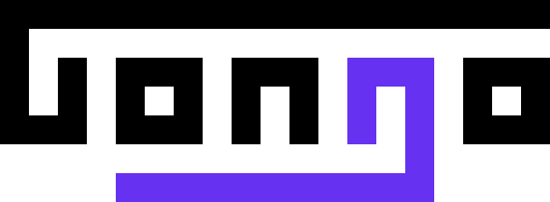

<h1>Gongo - The Go Go Engine</h1>

This repo is a server-side [Go](<https://en.wikipedia.org/wiki/Go_(game)>) (game) engine written in [Go](https://go.dev/) (language)

I'm building it primarily to prepare for my [upcoming job](https://www.maximahq.com/) in the Go language, so I'll be documenting some of that learning here.

---

## Project Infrastructure

- **Go Engine Code:** Referencing [GNU Go](https://www.gnu.org/software/gnugo/gnugo_4.html#SEC39), [KataGo](https://github.com/lightvector/KataGo/blob/master/cpp/README.md), and notably [LeelaZero](https://github.com/leela-zero)
- **Architecture:** Server/Client (until [Go WASM](https://github.com/golang/go/issues/28631) supports [threads](https://caniuse.com/wasm-threads))
- **Hosting:** [Railway](https://railway.app/)
- **Framework:** None (saved by [the crowd](https://www.reddit.com/r/golang/comments/q3r8qo/do_you_guys_use_frameworks_with_go_for_backend/))
- **CLI:** [Bubbletea](https://github.com/charmbracelet/bubbletea)
- **API Testing:** [Postman](https://www.postman.com/)
- **Website:** Hoping to host on _gongo.dev_ eventually ([this](https://www.reddit.com/r/baduk/comments/18cnmvj/awfull_experience_with_learning_go/) is motivation)

## Engine

Game engines will always have [tree traversal](https://en.wikipedia.org/wiki/Tree_traversal) and [evaluation](https://www.chessprogramming.org/Evaluation) at their roots. But beyond that, anything goes.

A top engine can either be _heuristic-based_ or learn dynamically from _self-play_. Learning through self-play is the [zeitgeist for Go engines](https://en.wikipedia.org/wiki/AlphaGo#History) like [AlphaGo](https://www.nature.com/articles/nature24270.epdf?author_access_token=VJXbVjaSHxFoctQQ4p2k4tRgN0jAjWel9jnR3ZoTv0PVW4gB86EEpGqTRDtpIz-2rmo8-KG06gqVobU5NSCFeHILHcVFUeMsbvwS-lxjqQGg98faovwjxeTUgZAUMnRQ), while heuristic-based is preferred for Chess engines like (my) [Hagnus Miemann](https://github.com/plettj/hagnusmiemann) or [Stockfish](https://github.com/official-stockfish/Stockfish).

I hope to implement _self-play_ learning in this Go engine.

## Notable Learnings

- Followed Go's official [tour](https://go.dev/tour/list) to learn the basics.
- Learned Go code structure from [these](https://go.dev/doc/modules/layout#server-project) [four](https://developer20.com/how-to-structure-go-code/) [layout](https://skife.org/golang/2013/03/24/go_dev_env.html) [standards](https://github.com/golang-standards/project-layout).
- Compared [gRPC vs REST](https://blog.postman.com/grpc-vs-rest/) ([and](https://blog.postman.com/grpc-vs-graphql/) [GraphQL](https://blog.postman.com/graphql-vs-rest/)). Decided on [REST](https://dev.to/envitab/how-to-build-an-api-using-go-ffk) with `gorilla/mux` (not `gin` or `chi`) to start.
- Compared [goCLI](https://github.com/urfave/cli) to [tview](https://github.com/rivo/tview) to [BubbleTea](https://github.com/charmbracelet/bubbletea), deciding on BubbleTea.
- Learned [Snowflake ID](https://en.wikipedia.org/wiki/Snowflake_ID)s to implement 8-character game IDs [like lichess](https://github.com/lichess-org/lila/blob/master/modules/game/src/main/IdGenerator.scala) (currently unbatched).
- Learned the [Elm Architecture](https://guide.elm-lang.org/architecture/) to understand [BubbleTea's basics](https://github.com/charmbracelet/bubbletea/tree/master/tutorials/basics).
- Go [slices](https://go.dev/blog/slices-intro).
- How to [write good comments](https://www.digitalocean.com/community/tutorials/how-to-write-comments-in-go).
- Dove into [SGF](https://red-bean.com/sgf/index.html) (specifically, [Go SGF](https://red-bean.com/sgf/go.html)) to write my own parser and converter. Examples [here](https://red-bean.com/sgf/examples/).
- Learned some [Go Compiler Intrinsics](https://dave.cheney.net/2019/08/20/go-compiler-intrinsics) so I could do [Go bit math](https://pkg.go.dev/math/bits) faster.
- Made [this](https://forums.online-go.com/t/is-there-ever-more-than-1-move-that-violates-positional-superko/53724) forum post about [Positional SuperKo](https://senseis.xmp.net/?PositionalVsSituationalSuperko#toc1) and snapshots of Go games.
- Explored [rooklift/sgf](https://pkg.go.dev/github.com/rooklift/sgf) and [seehun/go-sgf](https://pkg.go.dev/seehuhn.de/go/sgf), and then drained a lot of time brainstorming a new SGF standard.
- Watched [this](https://www.youtube.com/watch?v=x_nCOEMvmJI&list=PLmN0neTso3JzkiYiDcLzpKaIDNoEQwAUI) go-in-go programming series.
- Learned the [Flood Fill](https://en.wikipedia.org/wiki/Flood_fill) algorithm actually has a name.
- Learned the specifics of [function inlining](https://go.dev/wiki/CompilerOptimizations?utm_source=chatgpt.com#function-inlining) to optimize speed.

---

_Project approach is inspired by [Lucas](https://github.com/Strophox)'s [Tetrs in Rust](https://github.com/Strophox/tetrs?tab=readme-ov-file)._
